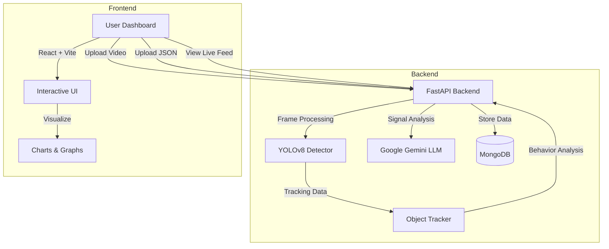

# UAV Sentinel - Advanced Aerial Threat Detection System


**UAV Sentinel** is a comprehensive full-stack solution for detecting, tracking, and analyzing Unmanned Aerial Vehicles (UAVs). Combining real-time computer vision (YOLOv8) with advanced RF signal analytics (Google Gemini), it provides actionable intelligence for airspace security.

---

## 🏗️ System Architecture



## 🚀 Key Features

### 1. 📹 Video Analysis Engine
*   **Real-time Detection**: powered by **YOLOv8**, capable of identifying drones in complex environments.
*   **Precision Tracking**: Maintains object identity across frames to track flight paths.
*   **Behavioral Analytics**: Detects anomalies like hovering, zone violations, or erratic flight patterns.
*   **Visual Overlays**: dynamic bounding boxes and track IDs rendered on the video feed.

### 2. 📡 RF Signal Analytics
*   **AI-Driven Insights**: Uses **Google Gemini 2.0 Flash** to analyze telemetry data (JSON) for potential threats.
*   **Risk Scoring**: Assigns a quantifiable risk score (0-100%) to detected signals.
*   **Historical Logging**: All analyses are stored in MongoDB for audit trails and trend analysis.

### 3. 🖥️ Command Dashboard
*   **Real-time Visualization**: Interactive charts for signal strength and threat probability.
*   **Dark Mode UI**: Optimized for low-light control room environments.
*   **Responsive Design**: Built with Tailwind CSS and shadcn/ui for use on any device.

---

## 🛠️ Tech Stack

| Component | Technology | Description |
| :--- | :--- | :--- |
| **Frontend** | React, Vite, TypeScript | High-performance UI framework |
| **Styling** | Tailwind CSS, shadcn/ui | Modern, utility-first styling |
| **State** | TanStack Query | Efficient server state management |
| **Backend** | FastAPI (Python) | High-performance async web framework |
| **AI / ML** | YOLOv8, OpenCV | Computer Vision & Object Detection |
| **LLM** | Google Gemini | Generative AI for signal analysis |
| **Database** | MongoDB | NoSQL database for logs and metadata |
| **DevOps** | Docker, Docker Compose | Containerization and orchestration |

---

## ⚙️ Installation & Setup

### Prerequisites
*   **Docker & Docker Compose** (Recommended)
*   OR: Python 3.9+, Node.js 18+, MongoDB

### Method 1: Docker (Recommended)

Run the entire stack with a single command.

1.  **Clone the repository**:
    ```bash
    git clone https://github.com/yourusername/uav-sentinel.git
    cd uav-sentinel
    ```

2.  **Configure Environment**:
    Create a `.env` file in the root directory (or use the one in `backend/`):
    ```env
    GEMINI_API_KEY=your_google_gemini_api_key
    MONGO_URI=mongodb://mongo:27017/uav_detection
    ```

3.  **Start Services**:
    ```bash
    docker-compose up --build
    ```
    *   Frontend: `http://localhost:8080`
    *   Backend: `http://localhost:8000`
    *   MongoDB: `localhost:27017`

### Method 2: Manual Setup

#### Backend
1.  Navigate to `backend/`:
    ```bash
    cd backend
    python -m venv venv
    source venv/bin/activate  # Windows: venv\Scripts\activate
    pip install -r requirements.txt
    ```
2.  Set up `.env` with your API keys.
3.  Run the server:
    ```bash
    python main.py
    ```

#### Frontend
1.  Navigate to the root directory:
    ```bash
    npm install
    ```
2.  Start the dev server:
    ```bash
    npm run dev
    ```

---

## 📖 API Reference

The backend exposes a RESTful API. Documentation is available at `http://localhost:8000/docs`.

| Method | Endpoint | Description |
| :--- | :--- | :--- |
| `POST` | `/analyze-video` | Upload a video file for detection and tracking. Returns processed video path. |
| `POST` | `/analyze-json` | Upload RF signal JSON data for Gemini AI analysis. |
| `GET` | `/video_feed` | Stream the live video feed from the configured camera source. |
| `GET` | `/stats` | Retrieve real-time system statistics (alert counts, detections). |
| `GET` | `/analysis-history` | Get a history of past RF signal analyses. |

---

## 🔧 Troubleshooting

**1. "Camera not found" in logs**
*   Ensure your webcam is connected if running locally.
*   If running in Docker, you may need to pass the device:
    ```yaml
    devices:
      - "/dev/video0:/dev/video0"
    ```
*   Alternatively, the system falls back to a test video file if configured in `main.py`.

**2. MongoDB Connection Error**
*   Ensure MongoDB is running (`docker ps` or check local service).
*   Check `MONGO_URI` in your `.env` file. Docker uses `mongodb://mongo:27017/...`, local uses `mongodb://localhost:27017/...`.

**3. "Gemini API Key missing"**
*   Get an API key from [Google AI Studio](https://aistudio.google.com/).
*   Add it to your `.env` file as `GEMINI_API_KEY`.

---

## 🔮 Future Roadmap

- [ ] **Hardware Integration**: Support for Software Defined Radio (SDR) for real-time RF capture.
- [ ] **Multi-Camera Support**: Fusion of data from multiple video feeds.
- [ ] **Edge Deployment**: Optimization for Jetson Nano / Raspberry Pi 5.
- [ ] **Mobile App**: React Native companion app for field notifications.

---

## 🤝 Contributing

Contributions are welcome! Please fork the repository and submit a Pull Request.

## 📄 License

Distributed under the MIT License. See `LICENSE` for more information.
